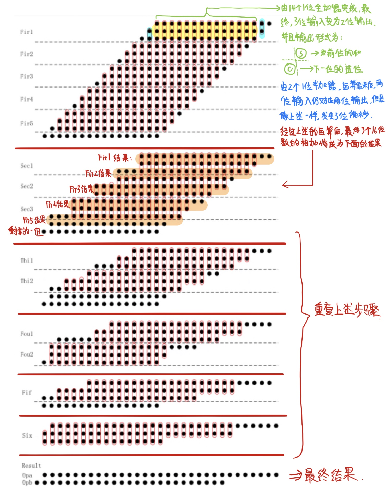

# 16 位有符号乘法器的设计
  

## 主要原理

乘法器结构框图：    
- 这里借鉴一下当时学习使用的 32 位乘法器结构图（仅供参考），本设计中的 16 位乘法器，除位数减半外，其他原理基本相同   


这个图中对应到我们自己需要的乘法器结构，主要结构也就是三个部分：**Booth 算法**、**Wallace 加法树**、以及一个 **32 位加法器**（两个 16 位数相乘最终结果是一个 32 位数） 。     

接下来进行详细介绍；

### Booth 算法    

在上述结构图中，描述的是三位一乘的 Booth 算法，更加高效。但是为了简化实现，选择了两位一乘的 Booth 算法，这是以后电路改进的一个着手点。

主要是为了简化乘法计算的步骤，能做到更快地实现有符号乘法；   

两个有符号补码数相乘推导过程如下：   
   

由此，对应到 16 位，也就有如下公式：     
- $[X \cdot Y]_补=[X]_补 \cdot (−y_{15} \cdot 2^{15}+y_{14} \cdot 2^{14}+\ …\ +y_1 \cdot 2^1+y_0 \cdot 2^0)$     

对右边括号内的式子，变形如下：     
- $−y_{15} \cdot 2^{15}+y_{14} \cdot 2^{14}+\ …\ +y_1 \cdot 2^1+y_0 \cdot 2^0$
- $=(y_{14}−y_{15}) \cdot 2^{15}+(y_{13}-y_{14}) \cdot 2^{14}+\ …\ +(y_0-y_1) \cdot 2^1+(y_{-1}-y_0) \cdot 2^0$  

因此，可以得出如下结论：
     

具体的实现过程也就如下：
    

借助此原理，我们就可以简单快速的计算出 16 个 32 位的部分积；

### Wallace 加法树

利用上述的 Booth 算法，我们将得到 16 个部分积，现在我们需要将这 16 个部分积相加，因此也就需要一种简洁高效的方法，Wallace 就是用来解决这个问题的。
- 串行把 16 个数相加, 需要 15 次加法时间；
- 用 15 个加法器组织成树状, 需要 4 次加法时间, 又浪费硬件；   

我们知道，一个 1 位的全加器，有 3 个输入（a，b，cin），两个输出（s，cout）。因此，它就相当于把三个数相加变成了两个数相加。   

Wallace 加法树就是基于全加器的这个特性，其主要思想就是：
- n 个全加器每次把三个 n 位的数相加转换成两个数（n+1 位）相加；
- 因此, n 个全加器每次可以把 m 个 n 位的数相加转换成 2m/3 个数相加, 再用一层全加器转换成 4m/9 个数相加, 直到转换成 2 个数; 再用加法器把最后两个数相加；

    

那么，针对 16 个数的 “某一位” 进行的 Wallace 加法树结构也就可以表示为如下：


### 32 位进位加法器

首先，比较好理解的就是串行进位加法器（下图是 16 位为例）：
   

但是这种方式，会浪费大量的时间在进位链的等待上。于是，选择**位数并行计算**（以 4 位并行为例），原理如下：


基于上述原理，我们就可以实现并行进位加法器，本设计里，采用的是一种：平方根进位（Square Root Carry Select）加法器。主要就是将所需计算的 32 位进行分级，每一级都采用不同位数的并行进位加法器实现，并且每一级计算的位数比前一级多 1（串行进位加法器每一级计算的位数都为 1）。

### 其他

在具体实现的过程中，还涉及到像全加器、半加器等其它器件，其实现比较简单，就不再具体描述。 


## 具体实现及 Verilog 代码

### 顶级模块

首先，从顶级模块开始，了解整个 16 位乘法器的主要结构，结构框图如下：   
     

对应的 Verilog 代码如下：

```verilog
//////////////////////////////////////
// 16 位乘法器的顶层模块，构建其整体框架
//////////////////////////////////////

module	TopMultiplier ( x_in, y_in, result_out );

    input	[15: 0]	x_in, y_in;
    output	[31: 0]	result_out;
    // 生成的中间互连，具体含义可见结构图
    wire	[15:0]	pp0, pp1, pp2, pp3, pp4, pp5, 
			pp6, pp7, pp8, pp9, pp10, pp11, 
			pp12, pp13, pp14, pp15; 
    wire	[31: 0]	opa, opb;
    wire	[15: 0]	sign;
    wire	[31: 0]	sign_compensate;
    wire	[31: 0]	res_tmp;

    // 部分积生成
    Booth booth (	.M( x_in ),
			.R( y_in ),
			.pp0( pp0 ),
			.pp1( pp1 ),
			.pp2( pp2 ),
			.pp3( pp3 ),
			.pp4( pp4 ),
			.pp5( pp5 ),
			.pp6( pp6 ),
			.pp7( pp7 ),
			.pp8( pp8 ),
			.pp9( pp9 ),
			.pp10( pp10 ),
			.pp11( pp11 ),
			.pp12( pp12 ),
			.pp13( pp13 ),
			.pp14( pp14 ),
			.pp15( pp15 ),
			.S( sign )
			);

    // 调用 wallace 树相加部分积
    WallaceTree16 wallace (	.pp0( pp0 ),
				.pp1( pp1 ),
				.pp2( pp2 ),
				.pp3( pp3 ),
				.pp4( pp4 ),
				.pp5( pp5 ),
				.pp6( pp6 ),
				.pp7( pp7 ),
				.pp8( pp8 ),
				.pp9( pp9 ),
				.pp10( pp10 ),
				.pp11( pp11 ),
				.pp12( pp12 ),
				.pp13( pp13 ),
				.pp14( pp14 ),
				.pp15( pp15 ),
				.opa( opa),
				.opb( opb)
			);

    // 计算部分积的符号补偿
    // 每一个部分积都应该有一位符号位，16 个部分积因此符号位应该是一个 16 位信号
    // 符号补偿需要扩展至 32 位，具体实现原理见下一节的 Booth 算法实现部分
    SRCS_Adder32 signcomp (.a( {~sign, 16'b0} ),
				.b( {15'b0, 1'b1, 16'b0} ),
				.cin( 1'b0 ),
				.sum( sign_compensate ),
				.cout()
				);

    // 部分积的和部分
    SRCS_Adder32 resulttemp (.a( opa ),
				.b( opb ),
				.cin( 1'b0 ),
				.sum( res_tmp ),
				.cout()
				);

    // 最终结果
    SRCS_Adder32 result (.a( res_tmp ),
				.b( sign_compensate ),
				.cin( 1'b0 ),
				.sum( result_out),
				.cout()
				);

endmodule
```

每一部分的原理可见前文介绍，接下里分别具体介绍每一模块的具体实现；   

### Booth 算法模块

对应的 Verilog 代码：   

```verilog
//////////////////////
// Booth 算法模块
//////////////////////

module 	Booth (	
    input	[15 : 0]	M,		// 被乘数，对应 x
    input	[15 : 0]	R,		// 乘数，对应 y
    // 部分积结果
    output	[15 : 0]    pp0, pp1, pp2, pp3,	
                            pp4, pp5, pp6, pp7, 
                            pp8, pp9, pp10, pp11, 
                            pp12, pp13, pp14, pp15,
    // 每一项部分积的扩展符号位
    output  [15 : 0]	S						
);

    // 对于乘数，在原理中介绍过需要不断比较连续两位，来计算部分积
    // 第一次比较时，需要在最低位做一个位扩展，即：y_-1=0
    wire [16 : 0]	tmp;
    assign tmp = {R, 1'b0};

    // 接下来，对整个扩展后的乘数不断进行选择两位比较：
    // ppi 的求法，可见原理图的表格；
    //		y[i],y[i-1] = 00 : 0
    //		y[i],y[i-1] = 01 : +x[补]
    //		y[i],y[i-1] = 10 : -x[补]，取反加一
    //		y[i],y[i-1] = 11 : 0
    // S[i] 保存部分积最高位的符号位；
    assign pp0 = (tmp[1:0] == 2'b01 ) ? M :
                (tmp[1:0] == 2'b10) ? ( ~M + 1'b1 ) : 16'b0;
    assign S[0] = pp0[15];

    assign pp1 = (tmp[2:1] == 2'b01 ) ? M :
                (tmp[2:1] == 2'b10) ? ( ~M + 1'b1 ) : 16'b0;
    assign S[1] = pp1[15];

    assign pp2 = (tmp[3:2] == 2'b01 ) ? M :
                (tmp[3:2] == 2'b10) ? ( ~M + 1'b1 ) : 16'b0;
    assign S[2] = pp2[15];

    assign pp3 = (tmp[4:3] == 2'b01 ) ? M :
                (tmp[4:3] == 2'b10) ? ( ~M + 1'b1 ) : 16'b0;
    assign S[3] = pp3[15];

    assign pp4 = (tmp[5:4] == 2'b01 ) ? M :
                (tmp[5:4] == 2'b10) ? ( ~M + 1'b1 ) : 16'b0;
    assign S[4] = pp4[15];

    assign pp5 = (tmp[6:5] == 2'b01 ) ? M :
                (tmp[6:5] == 2'b10) ? ( ~M + 1'b1 ) : 16'b0;
    assign S[5] = pp5[15];

    assign pp6 = (tmp[7:6] == 2'b01 ) ? M :
                (tmp[7:6] == 2'b10) ? ( ~M + 1'b1 ) : 16'b0;
    assign S[6] = pp6[15];

    assign pp7 = (tmp[8:7] == 2'b01 ) ? M :
                (tmp[8:7] == 2'b10) ? ( ~M + 1'b1 ) : 16'b0;
    assign S[7] = pp7[15];

    assign pp8 = (tmp[9:8] == 2'b01 ) ? M :
                (tmp[9:8] == 2'b10) ? ( ~M + 1'b1 ) : 16'b0;
    assign S[8] = pp8[15];

    assign pp9 = (tmp[10:9] == 2'b01 ) ? M :
                (tmp[10:9] == 2'b10) ? ( ~M + 1'b1 ) : 16'b0;
    assign S[9] = pp9[15];

    assign pp10 = (tmp[11:10] == 2'b01 ) ? M :
                (tmp[11:10] == 2'b10) ? ( ~M + 1'b1 ) : 16'b0;
    assign S[10] = pp10[15];

    assign pp11 = (tmp[12:11] == 2'b01 ) ? M :
                (tmp[12:11] == 2'b10) ? ( ~M + 1'b1 ) : 16'b0;
    assign S[11] = pp11[15];

    assign pp12 = (tmp[13:12] == 2'b01 ) ? M :
                (tmp[13:12] == 2'b10) ? ( ~M + 1'b1 ) : 16'b0;
    assign S[12] = pp12[15];

    assign pp13 = (tmp[14:13] == 2'b01 ) ? M :
                (tmp[14:13] == 2'b10) ? ( ~M + 1'b1 ) : 16'b0;
    assign S[13] = pp13[15];

    assign pp14 = (tmp[15:14] == 2'b01 ) ? M :
                (tmp[15:14] == 2'b10) ? ( ~M + 1'b1 ) : 16'b0;
    assign S[14] = pp14[15];

    assign pp15 = (tmp[16:15] == 2'b01 ) ? M :
                (tmp[16:15] == 2'b10) ? ( ~M + 1'b1 ) : 16'b0;
    assign S[15] = pp15[15];

endmodule
```

另外，这里有关符号位扩展（有关 sign 信号）是一个比较容易忽视的点，重点强调一下，需结合接下来要描述的 Wallace 树模块：   

在前面 Booth 算法里，有两项操作：+x[补]，和 -x[补]，这是带符号位的 16 位数，而前面介绍过，Wallace 树里进行部分积求和时，会有位数偏差关系，也就是需要对数进行符号位的扩展，而正负数的符号位扩展方式不同，因此，就还需要对符号位进行特殊处理：     

主要原理：
- 假设有符号的 4 位数为：SXXX，扩展到 8 位就是：SSSS_SXXX
- 而式子：SSSS_SXXX = 1111_S\*XXX + 0000_1000 （S\* 表示 S 位取反），成立
- 利用上式，就可以统一表示所有的符号位扩展；

运用：
- 将部分积统一成如下形式（Wallace 树里处理）：
  - 1111_1111_1111_111S\*_XXXX_XXXX_XXXX_XXXX
  - 1111_1111_1111_11S\*X_XXXX_XXXX_XXXX_XXX0
  - 1111_1111_1111_1S\*XX_XXXX_XXXX_XXXX_XX00
  - ......
  - 1S\*XX_XXXX_XXXX_XXXX_X000_0000_0000_0000
  - S\*XXX_XXXX_XXXX_XXXX_0000_0000_0000_0000
- 于是，利用 Wallace 树将 16 个部分积相加之后，再统一加上符号补偿向量：{~sign, 16'b0} 和 {15'b0, 1'b1, 16'b0}，就可以得到最终的运算结果；


### Wallace 树模块

在前面 Booth 算法中，输出了 16 个 16 位的信号，这里就是采用 Wallace 树简单高效的执行这些信号的相加（注意，不是简单的相加，存在位数偏移关系）；    

此模块是整个乘法器设计里，“最简单”，也是 “最复杂” 的模块。“最简单” 是因为其实现原理简单，就是通过全加器和半加器不断的缩小计算位数；“最复杂” 是因为 16 个 16 位的信号，都需要按位偏移进行处理，在整个器件和器件间的连线上都会变得十分复杂，而且很容易出错；

自己手动尝试了几次，都出错了。于是直接拿现成的 Wallace 树实现代码；     

针对代码中的相关定义，原作者给出的描述如下：
- 将整个过程分成了 6 个 stage，分别命名为：Fir，Sec，Thi，Fou，Fif，Six；
- 每个 stage 按照 3 位一层划分，分出若干层，并命名为：Fir1，Fir2，Sec3，Fou2等；
- 每一层的加法器就被称为：fir1ha0，fir2fa3 等，ha/fa 分别代表半加器/全加器；
- 每一层所有加法器的输出就被连接到2组线之中，比如：Fir1_S[15:0]，Fir1_C[15:0]，Sec2_S[17:0]，Sec2_C[17:0]，以此类推。每组线的宽度由各层的加法器数量决定；

基于这些定义，作者采用了一种叫做 “画圈” 法的方法，来保证准确不漏算（让我颇有感悟），整个过程描述如下：
     

其实，这个过程和我之前原理介绍里描述的基本相同，但是这种方式更加直观。     

接下来，把上述过程描述为 Verilog 代码，如下：
```verilog
/////////////////////////////////////////////////////////////////
// 16 位 Wallace Tree 模块：
//	完成 16 个 16 位的部分积求和过程，最终将输出两个 32 位数需要求和
/////////////////////////////////////////////////////////////////

module	WallaceTree16 ( 
	input	[15:0]	pp0, pp1, pp2, pp3, pp4, pp5, 
			pp6, pp7, pp8, pp9, pp10, pp11, 
			pp12, pp13, pp14, pp15, 
	output	[31:0]	opa, opb
	);

	//============== First Stage =================================================
	// fir 有 5 层需要计算

	// 每一层的计算结果，S 为求和输出，C 为进位输出
	wire	[15: 0]	Fir1_S, Fir1_C;
	wire	[15: 0]	Fir2_S, Fir2_C;
	wire	[15: 0]	Fir3_S, Fir3_C;
	wire	[15: 0]	Fir4_S, Fir4_C;
	wire	[15: 0]	Fir5_S, Fir5_C;

	// 按图示，第一阶段第一层，一共需要 16 个加法器（2 个半加器，14 个全加器）；
	// 并按位数对应关系表示如下；
	HalfAdder	fir1ha0( pp0[1], pp1[0], Fir1_S[0], Fir1_C[0] );
	FullAdder	fir1fa1( pp0[2], pp1[1], pp2[0], Fir1_S[1], Fir1_C[1] );
	FullAdder	fir1fa2( pp0[3], pp1[2], pp2[1], Fir1_S[2], Fir1_C[2] );
	FullAdder	fir1fa3( pp0[4], pp1[3], pp2[2], Fir1_S[3], Fir1_C[3] );
	FullAdder	fir1fa4( pp0[5], pp1[4], pp2[3], Fir1_S[4], Fir1_C[4] );
	FullAdder	fir1fa5( pp0[6], pp1[5], pp2[4], Fir1_S[5], Fir1_C[5] );
	FullAdder	fir1fa6( pp0[7], pp1[6], pp2[5], Fir1_S[6], Fir1_C[6] );
	FullAdder	fir1fa7( pp0[8], pp1[7], pp2[6], Fir1_S[7], Fir1_C[7] );
	FullAdder	fir1fa8( pp0[9], pp1[8], pp2[7], Fir1_S[8], Fir1_C[8] );
	FullAdder	fir1fa9( pp0[10], pp1[9], pp2[8], Fir1_S[9], Fir1_C[9] );
	FullAdder	fir1fa10( pp0[11], pp1[10], pp2[9], Fir1_S[10], Fir1_C[10] );
	FullAdder	fir1fa11( pp0[12], pp1[11], pp2[10], Fir1_S[11], Fir1_C[11] );
	FullAdder	fir1fa12( pp0[13], pp1[12], pp2[11], Fir1_S[12], Fir1_C[12] );
	FullAdder	fir1fa13( pp0[14], pp1[13], pp2[12], Fir1_S[13], Fir1_C[13] );
	FullAdder	fir1fa14( pp0[15], pp1[14], pp2[13], Fir1_S[14], Fir1_C[14] );
	HalfAdder	fir1ha15( pp1[15], pp2[14], Fir1_S[15], Fir1_C[15] );
	// 第一阶段第二层，具体描述同上，注意位数对应关系
	HalfAdder	fir2ha0( pp3[1], pp4[0], Fir2_S[0], Fir2_C[0] );
	FullAdder	fir2fa1( pp3[2], pp4[1], pp5[0], Fir2_S[1], Fir2_C[1] );
	FullAdder	fir2fa2( pp3[3], pp4[2], pp5[1], Fir2_S[2], Fir2_C[2] );
	FullAdder	fir2fa3( pp3[4], pp4[3], pp5[2], Fir2_S[3], Fir2_C[3] );
	FullAdder	fir2fa4( pp3[5], pp4[4], pp5[3], Fir2_S[4], Fir2_C[4] );
	FullAdder	fir2fa5( pp3[6], pp4[5], pp5[4], Fir2_S[5], Fir2_C[5] );
	FullAdder	fir2fa6( pp3[7], pp4[6], pp5[5], Fir2_S[6], Fir2_C[6] );
	FullAdder	fir2fa7( pp3[8], pp4[7], pp5[6], Fir2_S[7], Fir2_C[7] );
	FullAdder	fir2fa8( pp3[9], pp4[8], pp5[7], Fir2_S[8], Fir2_C[8] );
	FullAdder	fir2fa9( pp3[10], pp4[9], pp5[8], Fir2_S[9], Fir2_C[9] );
	FullAdder	fir2fa10( pp3[11], pp4[10], pp5[9], Fir2_S[10], Fir2_C[10] );
	FullAdder	fir2fa11( pp3[12], pp4[11], pp5[10], Fir2_S[11], Fir2_C[11] );
	FullAdder	fir2fa12( pp3[13], pp4[12], pp5[11], Fir2_S[12], Fir2_C[12] );
	FullAdder	fir2fa13( pp3[14], pp4[13], pp5[12], Fir2_S[13], Fir2_C[13] );
	FullAdder	fir2fa14( pp3[15], pp4[14], pp5[13], Fir2_S[14], Fir2_C[14] );
	HalfAdder	fir2ha15( pp4[15], pp5[14], Fir2_S[15], Fir2_C[15] );
	// 第一阶段第三层
	HalfAdder	fir3ha0( pp6[1], pp7[0], Fir3_S[0], Fir3_C[0] );
	FullAdder	fir3fa1( pp6[2], pp7[1], pp8[0], Fir3_S[1], Fir3_C[1] );
	FullAdder	fir3fa2( pp6[3], pp7[2], pp8[1], Fir3_S[2], Fir3_C[2] );
	FullAdder	fir3fa3( pp6[4], pp7[3], pp8[2], Fir3_S[3], Fir3_C[3] );
	FullAdder	fir3fa4( pp6[5], pp7[4], pp8[3], Fir3_S[4], Fir3_C[4] );
	FullAdder	fir3fa5( pp6[6], pp7[5], pp8[4], Fir3_S[5], Fir3_C[5] );
	FullAdder	fir3fa6( pp6[7], pp7[6], pp8[5], Fir3_S[6], Fir3_C[6] );
	FullAdder	fir3fa7( pp6[8], pp7[7], pp8[6], Fir3_S[7], Fir3_C[7] );
	FullAdder	fir3fa8( pp6[9], pp7[8], pp8[7], Fir3_S[8], Fir3_C[8] );
	FullAdder	fir3fa9( pp6[10], pp7[9], pp8[8], Fir3_S[9], Fir3_C[9] );
	FullAdder	fir3fa10( pp6[11], pp7[10], pp8[9], Fir3_S[10], Fir3_C[10] );
	FullAdder	fir3fa11( pp6[12], pp7[11], pp8[10], Fir3_S[11], Fir3_C[11] );
	FullAdder	fir3fa12( pp6[13], pp7[12], pp8[11], Fir3_S[12], Fir3_C[12] );
	FullAdder	fir3fa13( pp6[14], pp7[13], pp8[12], Fir3_S[13], Fir3_C[13] );
	FullAdder	fir3fa14( pp6[15], pp7[14], pp8[13], Fir3_S[14], Fir3_C[14] );
	HalfAdder	fir3ha15( pp7[15], pp8[14], Fir3_S[15], Fir3_C[15] );
	// 第一阶段第四层
	HalfAdder	fir4ha0( pp9[1], pp10[0], Fir4_S[0], Fir4_C[0] );
	FullAdder	fir4fa1( pp9[2], pp10[1], pp11[0], Fir4_S[1], Fir4_C[1] );
	FullAdder	fir4fa2( pp9[3], pp10[2], pp11[1], Fir4_S[2], Fir4_C[2] );
	FullAdder	fir4fa3( pp9[4], pp10[3], pp11[2], Fir4_S[3], Fir4_C[3] );
	FullAdder	fir4fa4( pp9[5], pp10[4], pp11[3], Fir4_S[4], Fir4_C[4] );
	FullAdder	fir4fa5( pp9[6], pp10[5], pp11[4], Fir4_S[5], Fir4_C[5] );
	FullAdder	fir4fa6( pp9[7], pp10[6], pp11[5], Fir4_S[6], Fir4_C[6] );
	FullAdder	fir4fa7( pp9[8], pp10[7], pp11[6], Fir4_S[7], Fir4_C[7] );
	FullAdder	fir4fa8( pp9[9], pp10[8], pp11[7], Fir4_S[8], Fir4_C[8] );
	FullAdder	fir4fa9( pp9[10], pp10[9], pp11[8], Fir4_S[9], Fir4_C[9] );
	FullAdder	fir4fa10( pp9[11], pp10[10], pp11[9], Fir4_S[10], Fir4_C[10] );
	FullAdder	fir4fa11( pp9[12], pp10[11], pp11[10], Fir4_S[11], Fir4_C[11] );
	FullAdder	fir4fa12( pp9[13], pp10[12], pp11[11], Fir4_S[12], Fir4_C[12] );
	FullAdder	fir4fa13( pp9[14], pp10[13], pp11[12], Fir4_S[13], Fir4_C[13] );
	FullAdder	fir4fa14( pp9[15], pp10[14], pp11[13], Fir4_S[14], Fir4_C[14] );
	HalfAdder	fir4ha15( pp10[15], pp11[14], Fir4_S[15], Fir4_C[15] );
	// 第一阶段第五层
	HalfAdder	fir5ha0( pp12[1], pp13[0], Fir5_S[0], Fir5_C[0] );
	FullAdder	fir5fa1( pp12[2], pp13[1], pp14[0], Fir5_S[1], Fir5_C[1] );
	FullAdder	fir5fa2( pp12[3], pp13[2], pp14[1], Fir5_S[2], Fir5_C[2] );
	FullAdder	fir5fa3( pp12[4], pp13[3], pp14[2], Fir5_S[3], Fir5_C[3] );
	FullAdder	fir5fa4( pp12[5], pp13[4], pp14[3], Fir5_S[4], Fir5_C[4] );
	FullAdder	fir5fa5( pp12[6], pp13[5], pp14[4], Fir5_S[5], Fir5_C[5] );
	FullAdder	fir5fa6( pp12[7], pp13[6], pp14[5], Fir5_S[6], Fir5_C[6] );
	FullAdder	fir5fa7( pp12[8], pp13[7], pp14[6], Fir5_S[7], Fir5_C[7] );
	FullAdder	fir5fa8( pp12[9], pp13[8], pp14[7], Fir5_S[8], Fir5_C[8] );
	FullAdder	fir5fa9( pp12[10], pp13[9], pp14[8], Fir5_S[9], Fir5_C[9] );
	FullAdder	fir5fa10( pp12[11], pp13[10], pp14[9], Fir5_S[10], Fir5_C[10] );
	FullAdder	fir5fa11( pp12[12], pp13[11], pp14[10], Fir5_S[11], Fir5_C[11] );
	FullAdder	fir5fa12( pp12[13], pp13[12], pp14[11], Fir5_S[12], Fir5_C[12] );
	FullAdder	fir5fa13( pp12[14], pp13[13], pp14[12], Fir5_S[13], Fir5_C[13] );
	FullAdder	fir5fa14( pp12[15], pp13[14], pp14[13], Fir5_S[14], Fir5_C[14] );
	HalfAdder	fir5ha15( pp13[15], pp14[14], Fir5_S[15], Fir5_C[15] );

	//============== Second Stage =================================================
	// sec 只有三层需要计算，但是需要注意和第一阶段输出的位数对应关系

	wire	[15: 0]	Sec1_S, Sec1_C;
	wire	[17: 0]	Sec2_S, Sec2_C;
	wire	[15: 0]	Sec3_S, Sec3_C;

	HalfAdder	sec1ha0( Fir1_S[1], Fir1_C[0], Sec1_S[0], Sec1_C[0] );
	FullAdder	sec1fa1( Fir1_S[2], Fir1_C[1], pp3[0], Sec1_S[1], Sec1_C[1] );
	FullAdder	sec1fa2( Fir1_S[3], Fir1_C[2], Fir2_S[0], Sec1_S[2], Sec1_C[2] );
	FullAdder	sec1fa3( Fir1_S[4], Fir1_C[3], Fir2_S[1], Sec1_S[3], Sec1_C[3] );
	FullAdder	sec1fa4( Fir1_S[5], Fir1_C[4], Fir2_S[2], Sec1_S[4], Sec1_C[4] );
	FullAdder	sec1fa5( Fir1_S[6], Fir1_C[5], Fir2_S[3], Sec1_S[5], Sec1_C[5] );
	FullAdder	sec1fa6( Fir1_S[7], Fir1_C[6], Fir2_S[4], Sec1_S[6], Sec1_C[6] );
	FullAdder	sec1fa7( Fir1_S[8], Fir1_C[7], Fir2_S[5], Sec1_S[7], Sec1_C[7] );
	FullAdder	sec1fa8( Fir1_S[9], Fir1_C[8], Fir2_S[6], Sec1_S[8], Sec1_C[8] );
	FullAdder	sec1fa9( Fir1_S[10], Fir1_C[9], Fir2_S[7], Sec1_S[9], Sec1_C[9] );
	FullAdder	sec1fa10( Fir1_S[11], Fir1_C[10], Fir2_S[8], Sec1_S[10], Sec1_C[10] );
	FullAdder	sec1fa11( Fir1_S[12], Fir1_C[11], Fir2_S[9], Sec1_S[11], Sec1_C[11] );
	FullAdder	sec1fa12( Fir1_S[13], Fir1_C[12], Fir2_S[10], Sec1_S[12], Sec1_C[12] );
	FullAdder	sec1fa13( Fir1_S[14], Fir1_C[13], Fir2_S[11], Sec1_S[13], Sec1_C[13] );
	FullAdder	sec1fa14( Fir1_S[15], Fir1_C[14], Fir2_S[12], Sec1_S[14], Sec1_C[14] );
	FullAdder	sec1fa15( pp2[15], Fir1_C[15], Fir2_S[13], Sec1_S[15], Sec1_C[15] );

	HalfAdder	sec2ha0( Fir2_C[1], pp6[0], Sec2_S[0], Sec2_C[0] );
	HalfAdder	sec2ha1( Fir2_C[2], Fir3_S[0], Sec2_S[1], Sec2_C[1] );
	FullAdder	sec2fa2( Fir2_C[3], Fir3_S[1], Fir3_C[0], Sec2_S[2], Sec2_C[2] );
	FullAdder	sec2fa3( Fir2_C[4], Fir3_S[2], Fir3_C[1], Sec2_S[3], Sec2_C[3] );
	FullAdder	sec2fa4( Fir2_C[5], Fir3_S[3], Fir3_C[2], Sec2_S[4], Sec2_C[4] );
	FullAdder	sec2fa5( Fir2_C[6], Fir3_S[4], Fir3_C[3], Sec2_S[5], Sec2_C[5] );
	FullAdder	sec2fa6( Fir2_C[7], Fir3_S[5], Fir3_C[4], Sec2_S[6], Sec2_C[6] );
	FullAdder	sec2fa7( Fir2_C[8], Fir3_S[6], Fir3_C[5], Sec2_S[7], Sec2_C[7] );
	FullAdder	sec2fa8( Fir2_C[9], Fir3_S[7], Fir3_C[6], Sec2_S[8], Sec2_C[8] );
	FullAdder	sec2fa9( Fir2_C[10], Fir3_S[8], Fir3_C[7], Sec2_S[9], Sec2_C[9] );
	FullAdder	sec2fa10( Fir2_C[11], Fir3_S[9], Fir3_C[8], Sec2_S[10], Sec2_C[10] );
	FullAdder	sec2fa11( Fir2_C[12], Fir3_S[10], Fir3_C[9], Sec2_S[11], Sec2_C[11] );
	FullAdder	sec2fa12( Fir2_C[13], Fir3_S[11], Fir3_C[10], Sec2_S[12], Sec2_C[12] );
	FullAdder	sec2fa13( Fir2_C[14], Fir3_S[12], Fir3_C[11], Sec2_S[13], Sec2_C[13] );
	FullAdder	sec2fa14( Fir2_C[15], Fir3_S[13], Fir3_C[12], Sec2_S[14], Sec2_C[14] );
	HalfAdder	sec2ha15( Fir3_S[14], Fir3_C[13], Sec2_S[15], Sec2_C[15] );
	HalfAdder	sec2ha16( Fir3_S[15], Fir3_C[14], Sec2_S[16], Sec2_C[16] );
	HalfAdder	sec2ha17( pp8[15], Fir3_C[15], Sec2_S[17], Sec2_C[17] );

	HalfAdder	sec3ha0( Fir4_S[1], Fir4_C[0], Sec3_S[0], Sec3_C[0] );
	FullAdder	sec3fa1( Fir4_S[2], Fir4_C[1], pp12[0], Sec3_S[1], Sec3_C[1] );
	FullAdder	sec3fa2( Fir4_S[3], Fir4_C[2], Fir5_S[0], Sec3_S[2], Sec3_C[2] );
	FullAdder	sec3fa3( Fir4_S[4], Fir4_C[3], Fir5_S[1], Sec3_S[3], Sec3_C[3] );
	FullAdder	sec3fa4( Fir4_S[5], Fir4_C[4], Fir5_S[2], Sec3_S[4], Sec3_C[4] );
	FullAdder	sec3fa5( Fir4_S[6], Fir4_C[5], Fir5_S[3], Sec3_S[5], Sec3_C[5] );
	FullAdder	sec3fa6( Fir4_S[7], Fir4_C[6], Fir5_S[4], Sec3_S[6], Sec3_C[6] );
	FullAdder	sec3fa7( Fir4_S[8], Fir4_C[7], Fir5_S[5], Sec3_S[7], Sec3_C[7] );
	FullAdder	sec3fa8( Fir4_S[9], Fir4_C[8], Fir5_S[6], Sec3_S[8], Sec3_C[8] );
	FullAdder	sec3fa9( Fir4_S[10], Fir4_C[9], Fir5_S[7], Sec3_S[9], Sec3_C[9] );
	FullAdder	sec3fa10( Fir4_S[11], Fir4_C[10], Fir5_S[8], Sec3_S[10], Sec3_C[10] );
	FullAdder	sec3fa11( Fir4_S[12], Fir4_C[11], Fir5_S[9], Sec3_S[11], Sec3_C[11] );
	FullAdder	sec3fa12( Fir4_S[13], Fir4_C[12], Fir5_S[10], Sec3_S[12], Sec3_C[12] );
	FullAdder	sec3fa13( Fir4_S[14], Fir4_C[13], Fir5_S[11], Sec3_S[13], Sec3_C[13] );
	FullAdder	sec3fa14( Fir4_S[15], Fir4_C[14], Fir5_S[12], Sec3_S[14], Sec3_C[14] );
	FullAdder	sec3fa15( pp11[15], Fir4_C[15], Fir5_S[13], Sec3_S[15], Sec3_C[15] );

	//============== Third Stage =================================================

	wire	[17: 0]	Thi1_S, Thi1_C;
	wire	[18: 0]	Thi2_S, Thi2_C;

	HalfAdder	thi1ha0( Sec1_S[1], Sec1_C[0], Thi1_S[0], Thi1_C[0] );
	HalfAdder	thi1ha1( Sec1_S[2], Sec1_C[1], Thi1_S[1], Thi1_C[1] );
	FullAdder	thi1fa2( Sec1_S[3], Sec1_C[2], Fir2_C[0], Thi1_S[2], Thi1_C[2] );
	FullAdder	thi1fa3( Sec1_S[4], Sec1_C[3], Sec2_S[0], Thi1_S[3], Thi1_C[3] );
	FullAdder	thi1fa4( Sec1_S[5], Sec1_C[4], Sec2_S[1], Thi1_S[4], Thi1_C[4] );
	FullAdder	thi1fa5( Sec1_S[6], Sec1_C[5], Sec2_S[2], Thi1_S[5], Thi1_C[5] );
	FullAdder	thi1fa6( Sec1_S[7], Sec1_C[6], Sec2_S[3], Thi1_S[6], Thi1_C[6] );
	FullAdder	thi1fa7( Sec1_S[8], Sec1_C[7], Sec2_S[4], Thi1_S[7], Thi1_C[7] );
	FullAdder	thi1fa8( Sec1_S[9], Sec1_C[8], Sec2_S[5], Thi1_S[8], Thi1_C[8] );
	FullAdder	thi1fa9( Sec1_S[10], Sec1_C[9], Sec2_S[6], Thi1_S[9], Thi1_C[9] );
	FullAdder	thi1fa10( Sec1_S[11], Sec1_C[10], Sec2_S[7], Thi1_S[10], Thi1_C[10] );
	FullAdder	thi1fa11( Sec1_S[12], Sec1_C[11], Sec2_S[8], Thi1_S[11], Thi1_C[11] );
	FullAdder	thi1fa12( Sec1_S[13], Sec1_C[12], Sec2_S[9], Thi1_S[12], Thi1_C[12] );
	FullAdder	thi1fa13( Sec1_S[14], Sec1_C[13], Sec2_S[10], Thi1_S[13], Thi1_C[13] );
	FullAdder	thi1fa14( Sec1_S[15], Sec1_C[14], Sec2_S[11], Thi1_S[14], Thi1_C[14] );
	FullAdder	thi1fa15( Fir2_S[14], Sec1_C[15], Sec2_S[12], Thi1_S[15], Thi1_C[15] );
	HalfAdder	thi1ha16( Fir2_S[15], Sec2_S[13], Thi1_S[16], Thi1_C[16] );
	HalfAdder	thi1ha17( pp5[15], Sec2_S[14], Thi1_S[17], Thi1_C[17] );

	HalfAdder	thi2ha0( Sec2_C[2], pp9[0], Thi2_S[0], Thi2_C[0] );
	HalfAdder	thi2ha1( Sec2_C[3], Fir4_S[0], Thi2_S[1], Thi2_C[1] );
	HalfAdder	thi2ha2( Sec2_C[4], Sec3_S[0], Thi2_S[2], Thi2_C[2] );
	FullAdder	thi2fa3( Sec2_C[5], Sec3_S[1], Sec3_C[0], Thi2_S[3], Thi2_C[3] );
	FullAdder	thi2fa4( Sec2_C[6], Sec3_S[2], Sec3_C[1], Thi2_S[4], Thi2_C[4] );
	FullAdder	thi2fa5( Sec2_C[7], Sec3_S[3], Sec3_C[2], Thi2_S[5], Thi2_C[5] );
	FullAdder	thi2fa6( Sec2_C[8], Sec3_S[4], Sec3_C[3], Thi2_S[6], Thi2_C[6] );
	FullAdder	thi2fa7( Sec2_C[9], Sec3_S[5], Sec3_C[4], Thi2_S[7], Thi2_C[7] );
	FullAdder	thi2fa8( Sec2_C[10], Sec3_S[6], Sec3_C[5], Thi2_S[8], Thi2_C[8] );
	FullAdder	thi2fa9( Sec2_C[11], Sec3_S[7], Sec3_C[6], Thi2_S[9], Thi2_C[9] );
	FullAdder	thi2fa10( Sec2_C[12], Sec3_S[8], Sec3_C[7], Thi2_S[10], Thi2_C[10] );
	FullAdder	thi2fa11( Sec2_C[13], Sec3_S[9], Sec3_C[8], Thi2_S[11], Thi2_C[11] );
	FullAdder	thi2fa12( Sec2_C[14], Sec3_S[10], Sec3_C[9], Thi2_S[12], Thi2_C[12] );
	FullAdder	thi2fa13( Sec2_C[15], Sec3_S[11], Sec3_C[10], Thi2_S[13], Thi2_C[13] );
	FullAdder	thi2fa14( Sec2_C[16], Sec3_S[12], Sec3_C[11], Thi2_S[14], Thi2_C[14] );
	FullAdder	thi2fa15( Sec2_C[17], Sec3_S[13], Sec3_C[12], Thi2_S[15], Thi2_C[15] );
	HalfAdder	thi2ha16( Sec3_S[14], Sec3_C[13], Thi2_S[16], Thi2_C[16] );
	HalfAdder	thi2ha17( Sec3_S[15], Sec3_C[14], Thi2_S[17], Thi2_C[17] );
	HalfAdder	thi2ha18( Fir5_S[14], Sec3_C[15], Thi2_S[18], Thi2_C[18] );

	//============== Fourth Stage =================================================

	wire	[19: 0]	Fou1_S, Fou1_C;
	wire	[15: 0]	Fou2_S, Fou2_C;

	HalfAdder	fou1ha0( Thi1_S[1], Thi1_C[0], Fou1_S[0], Fou1_C[0] );
	HalfAdder	fou1ha1( Thi1_S[2], Thi1_C[1], Fou1_S[1], Fou1_C[1] );
	HalfAdder	fou1ha2( Thi1_S[3], Thi1_C[2], Fou1_S[2], Fou1_C[2] );
	FullAdder	fou1fa3( Thi1_S[4], Thi1_C[3], Sec2_C[0], Fou1_S[3], Fou1_C[3] );
	FullAdder	fou1fa4( Thi1_S[5], Thi1_C[4], Sec2_C[1], Fou1_S[4], Fou1_C[4] );
	FullAdder	fou1fa5( Thi1_S[6], Thi1_C[5], Thi2_S[0], Fou1_S[5], Fou1_C[5] );
	FullAdder	fou1fa6( Thi1_S[7], Thi1_C[6], Thi2_S[1], Fou1_S[6], Fou1_C[6] );
	FullAdder	fou1fa7( Thi1_S[8], Thi1_C[7], Thi2_S[2], Fou1_S[7], Fou1_C[7] );
	FullAdder	fou1fa8( Thi1_S[9], Thi1_C[8], Thi2_S[3], Fou1_S[8], Fou1_C[8] );
	FullAdder	fou1fa9( Thi1_S[10], Thi1_C[9], Thi2_S[4], Fou1_S[9], Fou1_C[9] );
	FullAdder	fou1fa10( Thi1_S[11], Thi1_C[10], Thi2_S[5], Fou1_S[10], Fou1_C[10] );
	FullAdder	fou1fa11( Thi1_S[12], Thi1_C[11], Thi2_S[6], Fou1_S[11], Fou1_C[11] );
	FullAdder	fou1fa12( Thi1_S[13], Thi1_C[12], Thi2_S[7], Fou1_S[12], Fou1_C[12] );
	FullAdder	fou1fa13( Thi1_S[14], Thi1_C[13], Thi2_S[8], Fou1_S[13], Fou1_C[13] );
	FullAdder	fou1fa14( Thi1_S[15], Thi1_C[14], Thi2_S[9], Fou1_S[14], Fou1_C[14] );
	FullAdder	fou1fa15( Thi1_S[16], Thi1_C[15], Thi2_S[10], Fou1_S[15], Fou1_C[15] );
	FullAdder	fou1fa16( Thi1_S[17], Thi1_C[16], Thi2_S[11], Fou1_S[16], Fou1_C[16] );
	FullAdder	fou1fa17( Sec2_S[15], Thi1_C[17], Thi2_S[12], Fou1_S[17], Fou1_C[17] );
	HalfAdder	fou1ha18( Sec2_S[16], Thi2_S[13], Fou1_S[18], Fou1_C[18] );
	HalfAdder	fou1ha19( Sec2_S[17], Thi2_S[14], Fou1_S[19], Fou1_C[19] );

	HalfAdder	fou2ha0( Thi2_C[4], Fir5_C[0], Fou2_S[0], Fou2_C[0] );
	FullAdder	fou2fa1( Thi2_C[5], Fir5_C[1], pp15[0], Fou2_S[1], Fou2_C[1] );
	FullAdder	fou2fa2( Thi2_C[6], Fir5_C[2], pp15[1], Fou2_S[2], Fou2_C[2] );
	FullAdder	fou2fa3( Thi2_C[7], Fir5_C[3], pp15[2], Fou2_S[3], Fou2_C[3] );
	FullAdder	fou2fa4( Thi2_C[8], Fir5_C[4], pp15[3], Fou2_S[4], Fou2_C[4] );
	FullAdder	fou2fa5( Thi2_C[9], Fir5_C[5], pp15[4], Fou2_S[5], Fou2_C[5] );
	FullAdder	fou2fa6( Thi2_C[10], Fir5_C[6], pp15[5], Fou2_S[6], Fou2_C[6] );
	FullAdder	fou2fa7( Thi2_C[11], Fir5_C[7], pp15[6], Fou2_S[7], Fou2_C[7] );
	FullAdder	fou2fa8( Thi2_C[12], Fir5_C[8], pp15[7], Fou2_S[8], Fou2_C[8] );
	FullAdder	fou2fa9( Thi2_C[13], Fir5_C[9], pp15[8], Fou2_S[9], Fou2_C[9] );
	FullAdder	fou2fa10( Thi2_C[14], Fir5_C[10], pp15[9], Fou2_S[10], Fou2_C[10] );
	FullAdder	fou2fa11( Thi2_C[15], Fir5_C[11], pp15[10], Fou2_S[11], Fou2_C[11] );
	FullAdder	fou2fa12( Thi2_C[16], Fir5_C[12], pp15[11], Fou2_S[12], Fou2_C[12] );
	FullAdder	fou2fa13( Thi2_C[17], Fir5_C[13], pp15[12], Fou2_S[13], Fou2_C[13] );
	FullAdder	fou2fa14( Thi2_C[18], Fir5_C[14], pp15[13], Fou2_S[14], Fou2_C[14] );
	FullAdder	fou2fa15( pp14[15], Fir5_C[15], pp15[14], Fou2_S[15], Fou2_C[15] );

	//============== Fifth Stage =================================================

	wire	[23: 0]	Fif_S, Fif_C;

	HalfAdder	fifha0( Fou1_S[1], Fou1_C[0], Fif_S[0], Fif_C[0] );
	HalfAdder	fifha1( Fou1_S[2], Fou1_C[1], Fif_S[1], Fif_C[1] );
	HalfAdder	fifha2( Fou1_S[3], Fou1_C[2], Fif_S[2], Fif_C[2] );
	HalfAdder	fifha3( Fou1_S[4], Fou1_C[3], Fif_S[3], Fif_C[3] );
	HalfAdder	fifha4( Fou1_S[5], Fou1_C[4], Fif_S[4], Fif_C[4] );
	FullAdder	fiffa5( Fou1_S[6], Fou1_C[5], Thi2_C[0], Fif_S[5], Fif_C[5] );
	FullAdder	fiffa6( Fou1_S[7], Fou1_C[6], Thi2_C[1], Fif_S[6], Fif_C[6] );
	FullAdder	fiffa7( Fou1_S[8], Fou1_C[7], Thi2_C[2], Fif_S[7], Fif_C[7] );
	FullAdder	fiffa8( Fou1_S[9], Fou1_C[8], Thi2_C[3], Fif_S[8], Fif_C[8] );
	FullAdder	fiffa9( Fou1_S[10], Fou1_C[9], Fou2_S[0], Fif_S[9], Fif_C[9] );
	FullAdder	fiffa10( Fou1_S[11], Fou1_C[10], Fou2_S[1], Fif_S[10], Fif_C[10] );
	FullAdder	fiffa11( Fou1_S[12], Fou1_C[11], Fou2_S[2], Fif_S[11], Fif_C[11] );
	FullAdder	fiffa12( Fou1_S[13], Fou1_C[12], Fou2_S[3], Fif_S[12], Fif_C[12] );
	FullAdder	fiffa13( Fou1_S[14], Fou1_C[13], Fou2_S[4], Fif_S[13], Fif_C[13] );
	FullAdder	fiffa14( Fou1_S[15], Fou1_C[14], Fou2_S[5], Fif_S[14], Fif_C[14] );
	FullAdder	fiffa15( Fou1_S[16], Fou1_C[15], Fou2_S[6], Fif_S[15], Fif_C[15] );
	FullAdder	fiffa16( Fou1_S[17], Fou1_C[16], Fou2_S[7], Fif_S[16], Fif_C[16] );
	FullAdder	fiffa17( Fou1_S[18], Fou1_C[17], Fou2_S[8], Fif_S[17], Fif_C[17] );
	FullAdder	fiffa18( Fou1_S[19], Fou1_C[18], Fou2_S[9], Fif_S[18], Fif_C[18] );
	FullAdder	fiffa19( Thi2_S[15], Fou1_C[19], Fou2_S[10], Fif_S[19], Fif_C[19] );
	HalfAdder	fifha20( Thi2_S[16], Fou2_S[11], Fif_S[20], Fif_C[20] );
	HalfAdder	fifha21( Thi2_S[17], Fou2_S[12], Fif_S[21], Fif_C[21] );
	HalfAdder	fifha22( Thi2_S[18], Fou2_S[13], Fif_S[22], Fif_C[22] );
	HalfAdder	fifha23( Fir5_S[15], Fou2_S[14], Fif_S[23], Fif_C[23] );

	//============== Sixth Stage =================================================

	wire	[24: 0]	Six_S, Six_C;

	HalfAdder	sixha0( Fif_S[1], Fif_C[0], Six_S[0], Six_C[0] );
	HalfAdder	sixha1( Fif_S[2], Fif_C[1], Six_S[1], Six_C[1] );
	HalfAdder	sixha2( Fif_S[3], Fif_C[2], Six_S[2], Six_C[2] );
	HalfAdder	sixha3( Fif_S[4], Fif_C[3], Six_S[3], Six_C[3] );
	HalfAdder	sixha4( Fif_S[5], Fif_C[4], Six_S[4], Six_C[4] );
	HalfAdder	sixha5( Fif_S[6], Fif_C[5], Six_S[5], Six_C[5] );
	HalfAdder	sixha6( Fif_S[7], Fif_C[6], Six_S[6], Six_C[6] );
	HalfAdder	sixha7( Fif_S[8], Fif_C[7], Six_S[7], Six_C[7] );
	HalfAdder	sixha8( Fif_S[9], Fif_C[8], Six_S[8], Six_C[8] );
	FullAdder	sixfa9( Fif_S[10], Fif_C[9], Fou2_C[0], Six_S[9], Six_C[9] );
	FullAdder	sixfa10( Fif_S[11], Fif_C[10], Fou2_C[1], Six_S[10], Six_C[10] );
	FullAdder	sixfa11( Fif_S[12], Fif_C[11], Fou2_C[2], Six_S[11], Six_C[11] );
	FullAdder	sixfa12( Fif_S[13], Fif_C[12], Fou2_C[3], Six_S[12], Six_C[12] );
	FullAdder	sixfa13( Fif_S[14], Fif_C[13], Fou2_C[4], Six_S[13], Six_C[13] );
	FullAdder	sixfa14( Fif_S[15], Fif_C[14], Fou2_C[5], Six_S[14], Six_C[14] );
	FullAdder	sixfa15( Fif_S[16], Fif_C[15], Fou2_C[6], Six_S[15], Six_C[15] );
	FullAdder	sixfa16( Fif_S[17], Fif_C[16], Fou2_C[7], Six_S[16], Six_C[16] );
	FullAdder	sixfa17( Fif_S[18], Fif_C[17], Fou2_C[8], Six_S[17], Six_C[17] );
	FullAdder	sixfa18( Fif_S[19], Fif_C[18], Fou2_C[9], Six_S[18], Six_C[18] );
	FullAdder	sixfa19( Fif_S[20], Fif_C[19], Fou2_C[10], Six_S[19], Six_C[19] );
	FullAdder	sixfa20( Fif_S[21], Fif_C[20], Fou2_C[11], Six_S[20], Six_C[20] );
	FullAdder	sixfa21( Fif_S[22], Fif_C[21], Fou2_C[12], Six_S[21], Six_C[21] );
	FullAdder	sixfa22( Fif_S[23], Fif_C[22], Fou2_C[13], Six_S[22], Six_C[22] );
	FullAdder	sixfa23( Fou2_S[15], Fif_C[23], Fou2_C[14], Six_S[23], Six_C[23] );
	HalfAdder	sixha24( pp15[15], Fou2_C[15], Six_S[24], Six_C[24] );

	//============== Result Assignment ============================================

	assign	opa = { 1'b0, Six_S[24: 0], Fif_S[0], Fou1_S[0], Thi1_S[0],
			Sec1_S[0], Fir1_S[0], pp0[0] };
	assign	opb = { Six_C[24: 0], 7'b0 };

endmodule
```

可以看出来，整个过程是十分繁琐的，这里也是后期 FPGA 综合时，耗费 LUT 的主要所在。


### 32 位 SRCS 加法器

32 位平方根进位加法器的主要原理，已经在前面原理介绍部分介绍过，这里再说一下具体的实现过程；    
- 将 32 位的加法器分成 6 级来进行计算；
- 这 6 级，所需完成的加法位数为：3、4、5、6、7、7
- 每一级里都采用并行进位的计算方式，加快计算速度；

进位链的结构图如下：    

- 其中，并行进位模块里的具体求解原理可见原理解释部分；

描述为 verilog 代码，如下：
```verilog
////////////////////
// 32 位 SRCS_Adder32
////////////////////

module 	SRCS_Adder32 (a, b, cin, sum, cout);

    input 	[31 : 0]	a, b;   // 32 位输入
    input 			cin;    // 进位输入
    output	[31 : 0]	sum;    // 求和结果
    output			cout;   // 进位输出

    //	每一级小模块里对应的 I/O pin
    wire	[2 : 0]		p1, g1, c1_s0, c1_s1, c1;
    wire 	[3 : 0]		p2, g2, c2_s0, c2_s1, c2;
    wire 	[4 : 0]		p3, g3, c3_s0, c3_s1, c3;
    wire 	[5 : 0]		p4, g4, c4_s0, c4_s1, c4;
    wire 	[6 : 0]		p5, g5, c5_s0, c5_s1, c5;
    wire 	[6 : 0]		p6, g6, c6_s0, c6_s1, c6;

    //========== 第一级: M = 3 =================================================
    assign	g1 = a[2:0] & b[2:0]; // 进位生成因子
    assign	p1 = a[2:0] | b[2:0]; // 进位传递因子
    // 该模块最低位的进位因子 cin=0：
    assign	c1_s0[0] = g1[0];
    assign 	c1_s0[1] = g1[1] | (p1[1] & c1_s0[0]);
    assign 	c1_s0[2] = g1[2] | (p1[2] & c1_s0[1]);
    // 该模块最低位的进位因子 cin=1：
    assign	c1_s1[0] = g1[0] | p1[0];
    assign	c1_s1[1] = g1[1] | (p1[1] & c1_s1[0]);
    assign	c1_s1[2] = g1[2] | (p1[2] & c1_s1[1]);
    // 信号选择：
    assign	c1 = cin ? c1_s1 : c1_s0;
    // 求和得到某一位的求和值：
    assign	sum[2 : 0] = a[2:0] ^ b[2:0] ^ {c1[1:0], cin};
    //========== 第二级：M = 4 =================================================
    assign	g2 = a[6 : 3] & b[6 : 3];
    assign	p2 = a[6 : 3] | b[6 : 3];
    // 该模块最低位的进位因子 c1[2]=0
    assign	c2_s0[0] = g2[0];
    assign 	c2_s0[1] = g2[1] | (p2[1] & c2_s0[0]);
    assign 	c2_s0[2] = g2[2] | (p2[2] & c2_s0[1]);
    assign	c2_s0[3] = g2[3] | (p2[3] & c2_s0[2]);
    // 该模块最低位的进位因子 c1[2]=1
    assign	c2_s1[0] = g2[0] | p2[0];
    assign	c2_s1[1] = g2[1] | (p2[1] & c2_s1[0]);
    assign	c2_s1[2] = g2[2] | (p2[2] & c2_s1[1]);
    assign	c2_s1[3] = g2[3] | (p2[3] & c2_s1[2]);
    assign	c2 = c1[2] ? c2_s1 : c2_s0;
    assign	sum[6 : 3] = a[6 : 3] ^ b[6 : 3] ^ {c2[2:0], c1[2]};
    //========== 第三级：M = 5 =================================================
    assign	g3 = a[11 : 7] & b[11 : 7];
    assign	p3 = a[11 : 7] | b[11 : 7];
    assign	c3_s0[0] = g3[0];
    assign 	c3_s0[1] = g3[1] | (p3[1] & c3_s0[0]);
    assign 	c3_s0[2] = g3[2] | (p3[2] & c3_s0[1]);
    assign	c3_s0[3] = g3[3] | (p3[3] & c3_s0[2]);
    assign	c3_s0[4] = g3[4] | (p3[4] & c3_s0[3]);
    assign	c3_s1[0] = g3[0] | p3[0];
    assign	c3_s1[1] = g3[1] | (p3[1] & c3_s1[0]);
    assign	c3_s1[2] = g3[2] | (p3[2] & c3_s1[1]);
    assign	c3_s1[3] = g3[3] | (p3[3] & c3_s1[2]);
    assign	c3_s1[4] = g3[4] | (p3[4] & c3_s1[3]);
    assign	c3 = c2[3] ? c3_s1 : c3_s0;
    assign	sum[11 : 7] = a[11 : 7] ^ b[11 : 7] ^ {c3[3:0], c2[3]};
    //========== 第四级：M = 6 =================================================
    assign	g4 = a[17 : 12] & b[17 : 12];
    assign	p4 = a[17 : 12] | b[17 : 12];
    assign	c4_s0[0] = g4[0];
    assign 	c4_s0[1] = g4[1] | (p4[1] & c4_s0[0]);
    assign 	c4_s0[2] = g4[2] | (p4[2] & c4_s0[1]);
    assign	c4_s0[3] = g4[3] | (p4[3] & c4_s0[2]);
    assign	c4_s0[4] = g4[4] | (p4[4] & c4_s0[3]);
    assign	c4_s0[5] = g4[5] | (p4[5] & c4_s0[4]);
    assign	c4_s1[0] = g4[0] | p4[0];
    assign	c4_s1[1] = g4[1] | (p4[1] & c4_s1[0]);
    assign	c4_s1[2] = g4[2] | (p4[2] & c4_s1[1]);
    assign	c4_s1[3] = g4[3] | (p4[3] & c4_s1[2]);
    assign	c4_s1[4] = g4[4] | (p4[4] & c4_s1[3]);
    assign	c4_s1[5] = g4[5] | (p4[5] & c4_s1[4]);
    assign	c4 = c3[4] ? c4_s1 : c4_s0;
    assign	sum[17 : 12] = a[17 : 12] ^ b[17 : 12] ^ {c4[4:0], c3[4]};
    //========== 第五级：M = 7 =================================================
    assign	g5 = a[24 : 18] & b[24 : 18];
    assign	p5 = a[24 : 18] | b[24 : 18];
    assign	c5_s0[0] = g5[0];
    assign 	c5_s0[1] = g5[1] | (p5[1] & c5_s0[0]);
    assign 	c5_s0[2] = g5[2] | (p5[2] & c5_s0[1]);
    assign	c5_s0[3] = g5[3] | (p5[3] & c5_s0[2]);
    assign	c5_s0[4] = g5[4] | (p5[4] & c5_s0[3]);
    assign	c5_s0[5] = g5[5] | (p5[5] & c5_s0[4]);
    assign	c5_s0[6] = g5[6] | (p5[6] & c5_s0[5]);
    assign	c5_s1[0] = g5[0] | p5[0];
    assign	c5_s1[1] = g5[1] | (p5[1] & c5_s1[0]);
    assign	c5_s1[2] = g5[2] | (p5[2] & c5_s1[1]);
    assign	c5_s1[3] = g5[3] | (p5[3] & c5_s1[2]);
    assign	c5_s1[4] = g5[4] | (p5[4] & c5_s1[3]);
    assign	c5_s1[5] = g5[5] | (p5[5] & c5_s1[4]);
    assign	c5_s1[6] = g5[6] | (p5[6] & c5_s1[5]);
    assign	c5 = c4[5] ? c5_s1 : c5_s0;
    assign	sum[24 : 18] = a[24 : 18] ^ b[24 : 18] ^ {c5[5:0], c4[5]};
    //========== 第六级：M = 7 =================================================
    assign	g6 = a[31 : 25] & b[31 : 25];
    assign	p6 = a[31 : 25] | b[31 : 25];
    assign	c6_s0[0] = g6[0];
    assign 	c6_s0[1] = g6[1] | (p6[1] & c6_s0[0]);
    assign 	c6_s0[2] = g6[2] | (p6[2] & c6_s0[1]);
    assign	c6_s0[3] = g6[3] | (p6[3] & c6_s0[2]);
    assign	c6_s0[4] = g6[4] | (p6[4] & c6_s0[3]);
    assign	c6_s0[5] = g6[5] | (p6[5] & c6_s0[4]);
    assign	c6_s0[6] = g6[6] | (p6[6] & c6_s0[5]);
    assign	c6_s1[0] = g6[0] | p6[0];
    assign	c6_s1[1] = g6[1] | (p6[1] & c6_s1[0]);
    assign	c6_s1[2] = g6[2] | (p6[2] & c6_s1[1]);
    assign	c6_s1[3] = g6[3] | (p6[3] & c6_s1[2]);
    assign	c6_s1[4] = g6[4] | (p6[4] & c6_s1[3]);
    assign	c6_s1[5] = g6[5] | (p6[5] & c6_s1[4]);
    assign	c6_s1[6] = g6[6] | (p6[6] & c6_s1[5]);
    assign	c6 = c5[6] ? c6_s1 : c6_s0;
    assign	sum[31 : 25] = a[31 : 25] ^ b[31 : 25] ^ {c6[5:0], c5[6]};

    assign	cout = c6[6];

endmodule
```

关于这里的加法器，其实，如果在硬件资源足够的情况下，还可以进一步采用分层并行，提高执行速率，原理结构图如下：   
     

这也是以后，进行结构优化可以考虑的一个方向；

### 全加器、半加器

全加器：
```verilog
module 	FullAdder(a, b, cin, sum, cout);
    input 	a, b, cin;
    output 	sum, cout;
    assign	sum = a ^ b ^ cin;
    assign 	cout = (a & b) | (a & cin) | (b & cin);
endmodule
```

半加器：
```verilog
module HalfAdder(a, b, sum, cout);
    input   a, b;
    output  sum, cout;
    assign  sum = a ^ b;
    assign  cout = a & b;
endmodule
```

### 相关约束

本设计的 16 位乘法器是纯组合逻辑的电路，这里设置一个虚拟时钟信号 v_clk，并且给乘法器的 Input 和 Output 设置相关延迟信息，约束文件内容如下：

```
create_clock -period 20.000 -name v_clk -waveform {0.000 10.000} -add
set_input_delay -clock [get_clocks *v_clk*] -add_delay 0.200 [get_ports -filter { NAME !~  "*clk*" && DIRECTION == "IN" }]
set_output_delay -clock [get_clocks *v_clk*] -add_delay 0.200 [get_ports -filter { NAME =~  "*" && DIRECTION == "OUT" }]
```


学习链接：https://forums.xilinx.com/t5/Vivado/Vivado%E4%BD%BF%E7%94%A8%E8%AF%AF%E5%8C%BA%E4%B8%8E%E8%BF%9B%E9%98%B6-XDC%E7%BA%A6%E6%9D%9F%E6%8A%80%E5%B7%A7-I-O%E7%AF%87-%E4%B8%8A/td-p/570774


## 功能验证

### Test Bench 编写

原本我就是直接指定了 10 个 16 位的数，利用乘法器做了 5 次乘法操作，但是很显然，这种测试办法存在很大的偶尔性，又不可能将所有 16 位数的乘法全部跑一遍。原作者给出的一种 “随机抽查法” 的思路：
- 随机生成 100 对 16 位数；
- 针对这 100 对数的乘法，从两个方面进行，一方面利用被测加法器执行乘法，另一方面直接利用 `*` 乘符号执行运算，每对数据执行完毕后，将其值进行对比，记录不相同次数（即：所设计的乘法器出错次数）；

具体代码如下：

```verilog
///////////////////////////
// Test Bench
///////////////////////////

`timescale 1ns/1ps

// 乘法的检测对比模块
module multiplier_compare(a, b, p);
    input signed    [15:0] a, b;
    output signed   [31:0] p;
    assign          p = a*b;
endmodule

// tb 模块
module multiplier_tb;
    // 时钟信号
    parameter	TCLK = 22; // 略大于虚拟时钟v_clk=20
    reg		clk;
    // 测试过程中，我们需要关注的值
    reg		[15: 0]	x, y;       // 测试用例
    wire	[31: 0] res;        // 乘法器计算值
    wire   	[31: 0] res_com;    // 对照值
    // 初始化时钟信号，并且每过 5 个时钟单位，clk 跳变一次
    initial	clk = 1'b0;
    always #(TCLK/2)	clk = ~clk;
    
    // 存在计算错误时的部分
    reg[31: 0] res_com1, res_com2, res_com3; // 保存最近三次的计算结果
    reg[5 : 0] counter; // 错误计数
    initial counter = 0;
    always @(posedge clk)
        begin
            // 保存最近三次，正确的计算结果
            res_com1 <= res_com;
            res_com2 <= res_com1;
            res_com3 <= res_com2;
            if (res != res_com)
                counter <= counter+1;
        end

    // 生成 100 对乘法对，数量可以自行调控
    initial
        begin
            repeat(100)
                begin
                    // 生成 16 位的数据
                    // 也就是小于 17'h10000 的数据
                    x = {$random}%17'h10000;
                    y = {$random}%17'h10000;
                    // 每一对乘法数据延迟 TCLK
                    // 每一个 TCLK 里会有一次 clk 上升沿到来
                    // 每次 clk 上升沿进行一次错误检测
                    // 也就保证每对乘法数据都进行一次错误检测
                    #TCLK ; 
                end
            $stop;
        end

    // 调用加法器进行计算
    TopMultiplier multiplier_tb	(.x_in (x),
                                .y_in (y),
                                .result_out (res)
                                );
    // 调用加法，对比模块计算
    multiplier_compare	multiplier_com (.a(x),
                                        .b(y),
                                        .p(res_com)
                                        );

endmodule
```

### 功能仿真验证结果

在对上述 verilog 代码进行综合、仿真后，对整个波形图截取了其中的三部分，如下所示：   

   

- 由此波形图我们可以看到，这 100 次计算，之后 counter = 0，说明所设计的乘法器计算输出与预期输出完全相符，加法器实现正确；
- 另外，观察 clk 上升沿处的 res 和 res_com 的值，也可以证明乘法器设计正确；
- 其他 res_com1, res_com2, res_com3 这三个寄存器如期将最近三次的计算结果保存了下来；


## 其他结果展示

这里所展示的是首次尝试的结果。其中，Synthesis 采用 vivado 默认的优化策略（Vivado Systhesis Defaults）进行，Implementation 选择了 Performance_Explore 策略；


#### 资源利用率

   

本电路为组合电路，在资源使用上只占用了 LUT 和 IO。而占用的资源比较多，主要原因是：Wallace 树的实现比较复杂、符号位的处理调用了 3 次 SRCS 加法器。在以后，可以从简化 Wallace 树（符号位的处理放在这个模块里）、采用三位一乘的 Booth 算法（该算法一直可以提高计算速度，但是在并不一定会减少资源使用情况）。

#### 布局布线结果

    

本乘法器在资源上只使用了 LUT 和 IO 资源（图中蓝色部分所示），vivado 默认的优化策略还是在不出现拥塞的前提条件下，将相关的 CLB 尽量集中布在了一起，提高了使用效率。    

部分细节图：


#### 时序

   

可以看到，关键路径的延迟还是比较大。为了提高整个运算速度，后期改进方向：Booth 三位一乘算法、符号位的处理转移到 Wallace 里进行、Wallace 树结构的进一步优化。

#### 功耗

    

设计功耗还是基本符合预期要求的；


## 更换优化策略

前面提到乘法器存在许多重复的单元部分，对 LUT 的需求很大，也因此带来了较高的延迟。因此，整个电路的优化，就应该从 LUT 数着手。    

前面讨论过的从设计方案的角度着手减少 LUT 数，实现比较复杂，这里暂不讨论。这里主要从 Vivado 综合实现的优化策略着手进行优化。     

这里我选择了两种综合的优化策略和两种实现的优化策略，一共跑了 2 次综合，3 次实现，具体结果如下：  
      

通过此图，首先可以看到：
- 两次综合过程中采用了不同的优化策略，第二次采取的 Flow_AreaOptimized_high 策略，对面积进行了高度优化，因此可以看到第二次综合时，LUT 数明显减少了 81 个；
- 第一次综合后进行实现时，采用的策略只是略微减少了 LUT 数，第二次综合后的两次实现，又略微增加了 LUT。这也说明了 LUT 数主要是受综合过程影响的，而实现过程中 vivado 里给出的一些优化策略，可能会根据布局布线的需要对 LUT 进行一定的调整，但是这种调整对 LUT 的影响不大。
- LUT 数减少了，在面积上得到了一定的优化。但是面积优化往往和延迟优化是对立的，就像图中反映的一样，第二次综合里 WNS 也减少了将近一半，这也就意味着电路中关键路径的总延迟增加了 1.7 左右。因此，我们往往需要在这中间进行 trade-off。

# 源码来源
- https://github.com/wuzeyou/Multiplier16X16